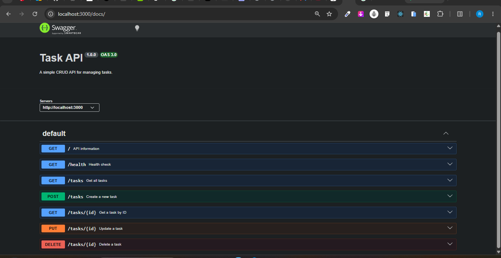

# Task API

A simple RESTful CRUD API built with **Node.js** and **Express.js** as part of the **FlyRank Backend Engineering Internship – Week 2 Assignment (BE-01)**.

This API allows users to create, read, update, and delete tasks using standard HTTP methods. The project also includes interactive API documentation using **Swagger UI**.

---

# Features

* Create a new task
* Retrieve all tasks
* Retrieve a single task by ID
* Update an existing task
* Delete a task
* Health check endpoint
* Interactive API documentation with Swagger UI
* Input validation
* Proper HTTP status codes
* In-memory data storage (no database)

---

# Technologies Used

* Node.js
* Express.js
* Swagger UI Express
* YAMLJS

---

# Installation

Clone the repository:

```bash
git clone https://github.com/abdulrasheed-ayomide/flyrank-be01-crud-api.git
```

Navigate into the project folder:

```bash
cd flyrank-be01-crud-api
```

Install dependencies:

```bash
npm install
```

---

# Running the Server

Start the application:

```bash
npm start
```

The server will run at:

```
http://localhost:3000
```

---

# API Endpoints

| Method | Endpoint   | Description              |
| ------ | ---------- | ------------------------ |
| GET    | /          | Returns API information  |
| GET    | /health    | Checks server health     |
| GET    | /tasks     | Returns all tasks        |
| GET    | /tasks/:id | Returns a task by ID     |
| POST   | /tasks     | Creates a new task       |
| PUT    | /tasks/:id | Updates an existing task |
| DELETE | /tasks/:id | Deletes a task           |

---

# Example Request

Retrieve all tasks:

```bash
curl -i http://localhost:3000/tasks
```

Example Response:

```http
HTTP/1.1 200 OK
Content-Type: application/json
```

```json
[
  {
    "id": 1,
    "title": "Learn Express",
    "done": false
  },
  {
    "id": 2,
    "title": "Build CRUD API",
    "done": false
  },
  {
    "id": 3,
    "title": "Push to Github",
    "done": false
  }
]
```

---

# Example POST Request

```bash
curl -X POST http://localhost:3000/tasks \
-H "Content-Type: application/json" \
-d "{\"title\":\"Buy milk\"}"
```

Response:

```json
{
  "id": 4,
  "title": "Buy milk",
  "done": false
}
```

---

# HTTP Status Codes

| Status Code | Meaning                       |
| ----------- | ----------------------------- |
| 200         | Successful request            |
| 201         | Resource created successfully |
| 204         | Resource deleted successfully |
| 400         | Invalid request data          |
| 404         | Task not found                |

---

## Swagger UI

Interactive API documentation is available at:

```text
http://localhost:3000/docs
```

### Swagger UI Screenshot



# Project Structure

```
flyrank-be01-crud-api
│
├── node_modules/
├── server.js
├── swagger.yaml
├── package.json
├── package-lock.json
├── README.md
└── swagger-ui.png
```

---

# Testing

The API was tested using:

* Swagger UI
* curl
* Browser

All CRUD operations were successfully verified.

---

# Assignment Requirements Completed

* Hello World server
* Root endpoint
* Health endpoint
* Read all tasks
* Read single task
* Create task
* Update task
* Delete task
* Input validation
* Proper HTTP status codes
* Swagger UI documentation
* Public GitHub repository
* Multiple Git commits

---

# Author

**Rasheed Abdulwaheed**

Backend Engineering Intern — FlyRank AI

GitHub:
https://github.com/abdulrasheed-ayomide
