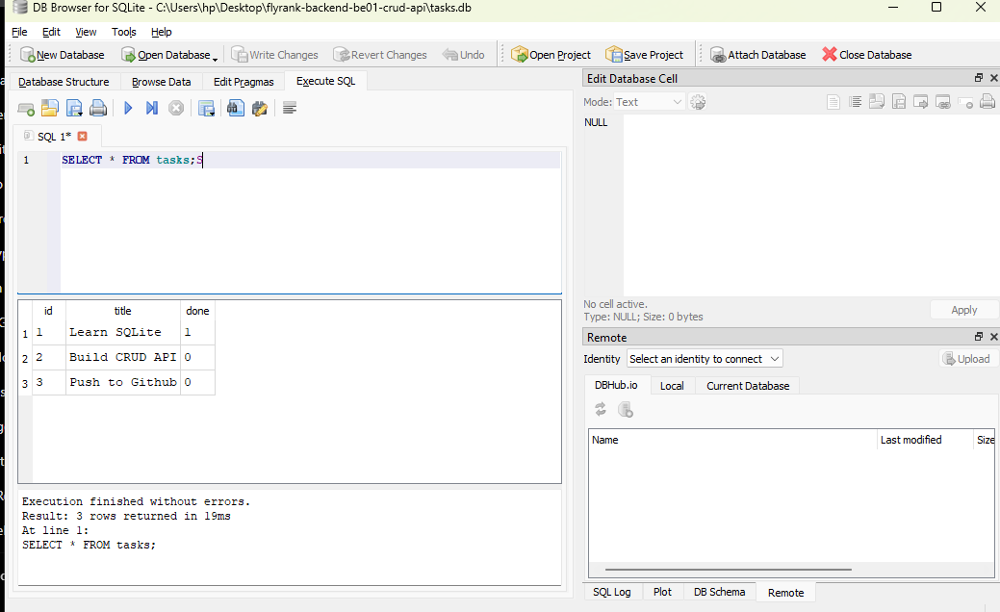

# Task API with SQLite

A simple RESTful CRUD API built with **Node.js**, **Express.js**, and **SQLite** as part of the **FlyRank Backend Engineering Internship – Week 3 Assignment (A2)**.

This project extends the previous CRUD API by replacing the in-memory storage with a **SQLite database**, allowing tasks to persist even after the server restarts. The API also includes interactive documentation using **Swagger UI**.

---

# Features

- Create a new task
- Retrieve all tasks
- Retrieve a task by ID
- Update an existing task
- Delete a task
- Health check endpoint
- Interactive API documentation with Swagger UI
- Input validation
- Proper HTTP status codes
- SQLite database for persistent storage
- Automatic database and table creation
- Automatic seeding of sample tasks on first run

---

# Technologies Used

- Node.js
- Express.js
- SQLite
- better-sqlite3
- Swagger UI Express
- YAMLJS

---

# Why SQLite?

SQLite was chosen because it is lightweight, requires no separate database server, stores data in a single file (`tasks.db`), and automatically preserves data after the server restarts. It is ideal for learning backend development and building small applications.

---

# Installation

Clone the repository:

```bash
git clone https://github.com/abdulrasheed-ayomide/flyrank-be01-crud-api.git
```

Navigate into the project folder:

```bash
cd flyrank-be01-crud-api
```

Install dependencies:

```bash
npm install
```

---

# Running the Server

Start the application:

```bash
npm start
```

The server runs at:

```
http://localhost:3000
```

When the server starts for the first time:

- `tasks.db` is created automatically.
- The `tasks` table is created automatically.
- Three sample tasks are inserted only if the table is empty.

---

# Project Structure

```text
flyrank-be01-crud-api
│
├── node_modules/
├── server.js
├── swagger.yaml
├── tasks.db
├── package.json
├── package-lock.json
├── README.md
└── swagger-ui.png
```

---

# API Endpoints

| Method | Endpoint | Description |
|--------|----------|-------------|
| GET | / | API information |
| GET | /health | Server health |
| GET | /tasks | Get all tasks |
| GET | /tasks/:id | Get one task |
| POST | /tasks | Create a task |
| PUT | /tasks/:id | Update a task |
| DELETE | /tasks/:id | Delete a task |

---

# Example SQL Query

```sql
SELECT * FROM tasks WHERE done = 1;
```

This query returns all completed tasks stored in the database.

---

# Example API Request

```bash
curl http://localhost:3000/tasks
```

Example Response:

```json
[
  {
    "id": 1,
    "title": "Learn SQLite",
    "done": 1
  },
  {
    "id": 2,
    "title": "Build CRUD API",
    "done": 0
  },
  {
    "id": 3,
    "title": "Push to Github",
    "done": 0
  }
]
```

---

# HTTP Status Codes

| Status Code | Meaning |
|-------------|---------|
| 200 | OK |
| 201 | Created |
| 204 | No Content |
| 400 | Bad Request |
| 404 | Not Found |

---

# Swagger UI

Interactive API documentation is available at:

```
http://localhost:3000/docs
```

### Swagger Screenshot


---

# SQLite Database Screenshot



---

# Testing

The API was tested using:

- Swagger UI
- curl
- DB Browser for SQLite

All CRUD operations were successfully tested, including persistence after restarting the server.

---

# Assignment Requirements Completed

- Create SQLite database automatically
- Create tasks table automatically
- Seed sample tasks once
- Read tasks from SQLite
- Create tasks in SQLite
- Update tasks in SQLite
- Delete tasks from SQLite
- Parameterized SQL queries
- Proper HTTP status codes
- Swagger documentation
- Database persists after server restart
- Public GitHub repository
- Multiple Git commits

---

# Notes

- The database file (`tasks.db`) is automatically created if it does not exist.
- Sample tasks are inserted only on the first run.
- Data remains available even after restarting the server.

---

# Author

**Rasheed Abdulwaheed**

Backend Engineering Intern — FlyRank AI

GitHub:
https://github.com/abdulrasheed-ayomide